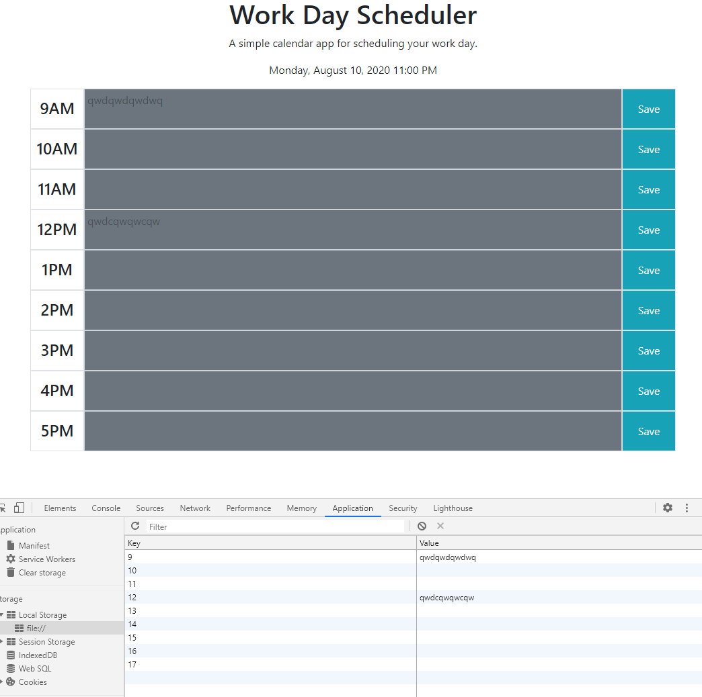

# 05-Third-Party-APIs

* A Workday Scheduler that displays saved events and updates the times with color-coding based on it's relation to the current time

* This project was tough only because debugging was much harder when not within the hours used on the scheduler

* Below is an image of what would happen when using the scheduler outside of the hours shown, with the locally stored values showing in DevTools

